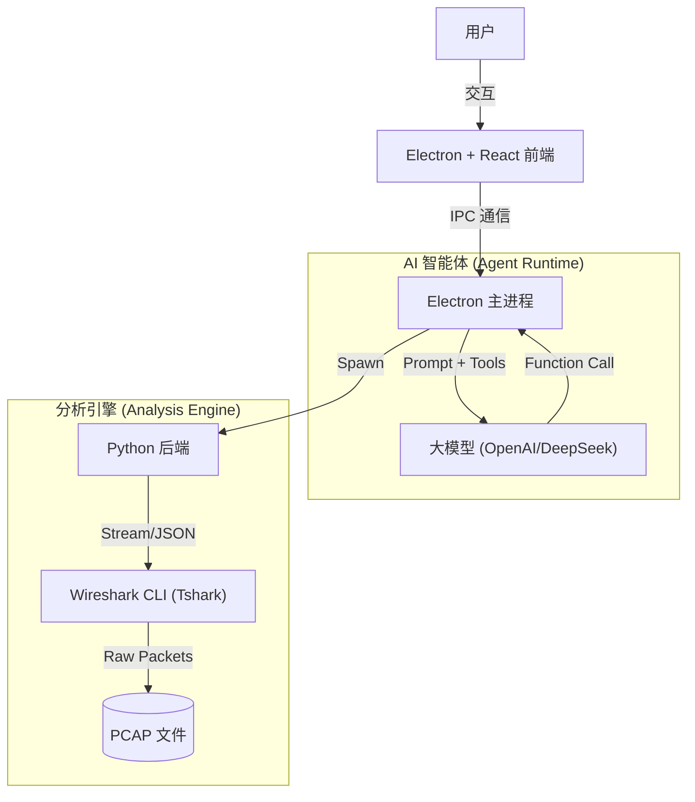

# NetLens (网络透镜)

**专业的 AI 驱动网络流量分析与可视化平台** | v0.2.3

NetLens 将 Wireshark 的深度解析能力与现代 AI 的推理能力相结合，为网络工程师、安全研究员提供了一个高性能、可视化、智能化的分析工具。

---

## 💡 核心价值

传统的网络分析工具（如 Wireshark）功能强大但门槛极高，用户需要记忆复杂的过滤语法，并人工从海量数据中寻找线索。NetLens 旨在解决以下痛点：

1.  **智能化 (Intelligent)**: 内置 AI 分析师，用户可以通过自然语言提问（如"帮我看看有没有 SQL 注入"），AI 自动调用工具进行排查。
2.  **可视化 (Visual)**: 提供交互式 TCP 时序图、全量包头详情树、流量趋势图，将枯燥的数据转为直观的图表。
3.  **关联性 (Correlated)**: 独有的"多文件关联分析"功能，能够自动对比防火墙内外的抓包文件，精准定位丢包和时延。
4.  **高性能 (Performance)**: 底层基于 Tshark 流式解析，内存占用极低，轻松处理 GB 级大文件。

---

## 🏗️ 技术架构

NetLens 采用现代化的混合架构，兼顾了前端的灵活性与后端的性能。

### 🤖 AI 调用逻辑 (ReAct 模式)

NetLens 不仅仅是把数据发给 AI，而是实现了一个完整的 **ReAct (Reasoning + Acting)** 循环：

1.  **感知**: 用户输入自然语言问题。
2.  **思考**: AI 分析用户意图，决定需要调用哪些工具（如 `scan_security_threats`）。
3.  **行动**: Electron 拦截 AI 的指令，在本地调用 Python/Tshark 执行实际分析。**原始 PCAP 数据永远不会上传给 AI，仅上传脱敏后的统计结果 (JSON)**，最大程度保护隐私。
4.  **反馈**: 工具执行结果返回给 AI。
5.  **回答**: AI 综合数据生成最终报告。

---

## 🌟 功能特性

### 1. TCP 会话分析
*   **通讯对列表**: 展示所有 TCP 会话，包含源/目的 IP、端口、包数、流量、持续时间。
*   **交互式流视图**: 点击会话展开，以类似聊天气泡的方式展示数据包交互过程，左侧为接收、右侧为发送。
*   **协议分层树**: 点击任意数据包气泡，底部展示完整的协议栈详情（Frame → Ethernet → IP → TCP → 应用层）。

### 2. 故障诊断 (Troubleshooting)
*   **TCP 健康体检**: 自动检测重传 (Retransmission)、零窗口 (Zero Window)、乱序、Reset 等异常。
*   **异常会话聚合**: 按会话分组展示异常事件，快速定位问题连接。

### 3. 协议深度分析
*   **HTTP**: 提取 User-Agent, Content-Type, Cookie，支持 JSON/Text Body 预览。
*   **TLS**: 解析握手信息，展示证书链 (Issuer, Subject, Validity)。
*   **DNS**: 识别 NXDOMAIN 错误，展示完整的查询/响应树。

### 4. 多点关联分析
*   导入两个抓包文件（如源端和目的端），系统自动基于 TCP Seq/Ack 匹配数据流。
*   直观展示 **丢包 (Packet Loss)** 和 **时延 (Latency)**。

### 5. 安全分析
*   **端口扫描检测**: 识别单一 IP 对多端口的 SYN 探测行为。
*   **SQL 注入 / XSS 检测**: 基于 Payload 正则匹配常见攻击特征。
*   **明文凭证告警**: 检测 Basic Auth 等敏感信息。

---

## 🛠 安装与使用

### 前置要求
*   **macOS** (目前仅支持 Mac)
*   系统需安装 **Wireshark** (确保 `tshark` 命令可用)。

### 安装
从 [Releases](https://github.com/Matthewyin/nssa-netlens/releases) 页面下载最新的 `.dmg` 安装包。

### 使用指南
1.  **启动**: 打开 NetLens。
2.  **配置 AI**: 点击左下角 `⚙️ 设置`，输入您的 API Key 和 Base URL (支持 OpenAI, DeepSeek, Ollama 等)。点击"验证"确保连接成功。
3.  **导入数据**: 点击左上角 `+` 选择一个或两个 `.pcap` 文件。
4.  **开始分析**:
    *   **手动模式**: 点击侧边栏的 "HTTP"、"故障诊断" 等按钮查看报表。
    *   **AI 模式**: 点击右侧 "🤖 AI 分析师"，输入 "分析一下这个包的异常"，等待 AI 给出报告。

---

## 📋 更新日志

### v0.2.3 (2025-01-28)
*   **修复**: TCP 会话分析中点击数据包气泡导致黑屏的问题（PacketDetailTree 组件未导入）
*   **增强**: 完善 TCP 会话的交互式流视图功能描述

### v0.2.2
*   文档和许可证更新

### v0.2.1
*   UI/UX 修复和 AI 增强

### v0.2.0
*   新增 AI Copilot、分屏视图、多文件关联分析

---

## ⚠️ 版权声明

本项目 (**NetLens**) 仅供网络安全研究、教学及故障排查使用。

*   **非商业用途**: 未经授权，禁止将本项目用于商业产品集成或销售。
*   **免责声明**: 使用本工具进行网络分析时请遵守当地法律法规，开发者不对使用本工具造成的任何后果负责。

License: **MIT (Non-Commercial Use Suggested)**
