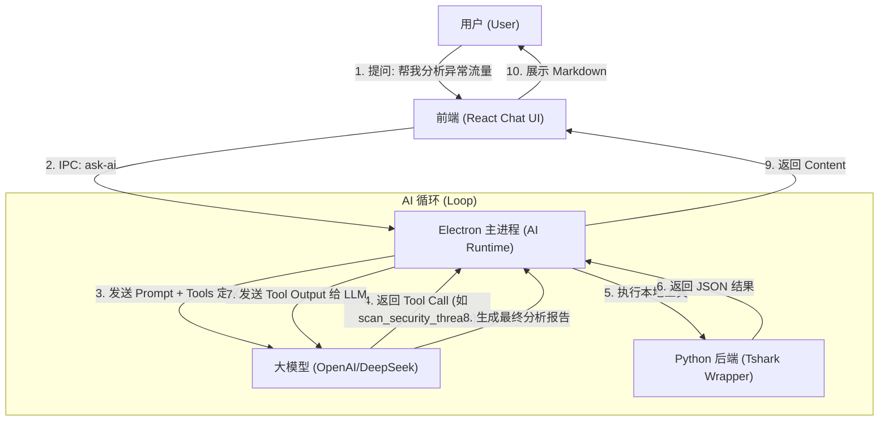

# NetLens (网络透镜)

NetLens 是一款专业级、AI 驱动的网络流量分析与可视化工具，基于 Electron、React 和 Python (Tshark) 构建。

## 🌟 核心特性 (v0.2.1)

### 🤖 AI 分析师 (AI Copilot)
*   **智能对话**: 内置 AI 助手，支持自然语言提问（如"帮我分析为什么连接慢"）。
*   **多模型支持**: 兼容 OpenAI、DeepSeek、Ollama 等多种模型配置，支持一键切换与**连接验证**。
*   **多文件智能对比**: AI 可识别并对比两个抓包文件，自动调用关联引擎查找丢包与时延。
*   **工具调用**: AI 可直接调用后端 Tshark 引擎进行实时数据查询与分析。
*   **安全存储**: API Key 采用系统级加密存储 (Keychain/DPAPI)，保障凭证安全。

### 📊 深度可视化 (Deep Visualization)
*   **故障诊断**: 交互式 TCP 时序图 (Sequence Diagram)，自动检测重传、零窗口、丢包等异常，并提供专家级建议。
*   **主从视图**: HTTP/DNS/TLS 分析全面采用 Master-Detail 双栏布局，左侧极速列表，右侧全量包头详情。
*   **多文件关联**: 支持同时导入两个抓包文件（如防火墙内外），自动关联数据流并计算时延与丢包情况。

### ⚡️ 高性能内核 (High Performance)
*   **Zero-Scapy**: 全面迁移至 Tshark 流式解析架构，轻松处理 GB 级大文件，内存占用极低。
*   **全量搜索**: 支持 Tshark 显示过滤器语法的后端搜索，实现真正的数据深挖。

## 🛠 安装与使用

### v0.2.1 更新日志
- **修复**: AI 无法读取第二个文件路径的问题。
- **修复**: 应用 Logo 显示异常。
- **优化**: 设置界面支持自动保存和多配置管理。
- **优化**: 全局搜索升级为后端驱动，支持正则和复杂语法。
- **优化**: 聊天窗口支持宽屏模式和独立消息复制。

### 前置要求
- 系统需安装 [Wireshark](https://www.wireshark.org/) (确保 `tshark` 命令可用)。

### 下载安装
从 [Releases](https://github.com/Matthewyin/nssa-netlens/releases) 页面下载最新的 `.dmg` 安装包（macOS）。

## 🏗️ 开发指南

### 环境准备
1.  Clone 代码仓库。
2.  前端依赖: `cd frontend && npm install`
3.  后端依赖: `cd backend && uv sync` (推荐使用 uv 管理 Python 环境)

### 运行开发版
```bash
cd frontend && npm run dev
```

### 构建发布
```bash
# 1. 构建后端二进制
bash backend/build_backend.sh

# 2. 打包 Electron 应用
cd frontend && npm run build:mac
```

## 🤖 AI 配置指南
1.  点击左下角 "⚙️ 设置"。
2.  添加 AI 配置（支持 OpenAI 格式的 API）。
3.  点击 "验证连接" 确保配置正确。
4.  保存后即可在右侧边栏与 AI 分析师对话。

## ⚖️ License
MIT




